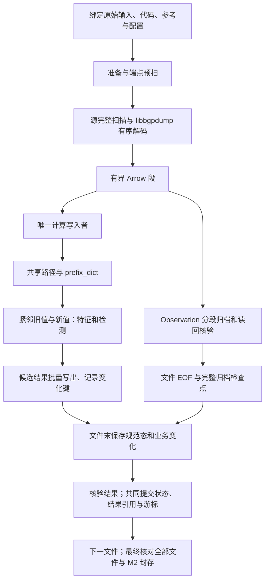

# 数据流水线加速改动与当前困境

整理日期：2026-09-18。结论：**主通路已改成有序批次直接推进共享状态，但完整 RIB＋8 小时 UPDATE 的一小时目标仍未通过，判定为 REPAIR。** 本文汇总已经发生的改动与实测，不把后续方向写成已实现能力。

本次总结编写只整理文档，没有修改业务代码或重跑数据。源码来自 `72ae` 工作树，分支 `codex/m2-incremental-paths`，HEAD 为 `7e52d8712f5da4c08306ab933f20e1d83bb2ca25`，另有大量未提交改动。各次实验的冻结源码不同，不能只凭相同 HEAD 认为它们测试了同一实现。2026-09-18 的共享内存简化在该轮交付时仅为本地源码，未用于此前六小时的伊朗任务；随后按用户要求同步服务器源码目录，范围及服务状态见[运行手册](../runbooks/运行与维护.md#2026-09-18-源码目录同步)。源码同步不改变本文性能与恢复未通过的结论。

本文负责加速改动、历史测量及剩余问题的汇总；当前调用链以[系统结构与数据流](系统结构与数据流.md#文件级路由状态流水线隔离候选)为准，持久化决策见[分层存储 ADR](../adr/0002-layered-data-storage.md)，启动和验收操作见[运行手册](../runbooks/运行与维护.md#真实主链路的一小时性能验收)。文中实测均来自保留回执，本次没有重新执行测试。

## 1. 目标与比较口径

已接受的计算主线是：**共享内存状态 → 直接计算业务字段 → 批量写结果。** 原始 MRT 永久保留，完整属性及原始观察归档；业务在有序批次到达时计算，文件完整通过校验后确认状态和结果。

最终性能门槛仍是 RRC25 完整 `bview.20260226.1600.gz` 加 UTC 16:00—24:00 连续 96 份 UPDATE，共 97 份、压缩 1,103,002,027 字节，从原始输入与空状态开始，包含准备、解析、归档、普通 Feature、Detection、持久化、完整校验和既有只读结果入口验证，总墙钟不超过 3600 秒。正确性、恢复和资源同时通过才是 GO；组件提速或文件成功提交不等于达标。

对应预算为整个隔离任务 8 CPU／64 GiB，含数据库及文件缓存；PG 子预算 1 CPU／4 GiB，临时输出不超过 128 GiB，至少保留 20 GiB 可用空间。分项和完整运行分别计时，并行及嵌套阶段不能相加，CPU 时间不能换算成任务电能。

后来的“只跑伊朗特征”是一项独立的单日任务：1 RIB＋288 UPDATE、IR Feature 开启、Detection 关闭。它没有替代普通 Feature＋Detection 的 97 文件验收；不同业务配置的耗时不能直接计算优化倍数。该任务已取消并清理。

## 2. 改动之前为什么慢

早期新链路的计算路径是：

```text
整份 MRT 解码并分表入库
  → 文件检查点
  → message／element／path 关联与全局排序
  → Arrow 小批转逐条 Python 对象
  → 规范状态和各业务投影
  → 编码状态、保存结果
```

文件级流水线曾允许“文件 N 计算”与“文件 N＋1 归档”重叠，但文件 N 的计算仍须等待其整文件归档和关联，不能称为同批输入的实时计算。

直接批次接通后，整文件等待被消除，另一些成本仍留在计算路径中：路径缓存写 SQLite、JSON 编解码与读回；变化槽逐批写 PG；业务每文件全量遍历与编码；逐条构造适配对象、证据和快照。计算端跟不上时，有界队列反压解析与归档。因此“换成 libbgpdump”或“去掉 JOIN”都没有单独解决完整链路吞吐。

旧 Domeye 提供的参考是其执行方式：RIB／UPDATE 顺序取出必要字段，主要更新内存中的 `prefix_dict`、起源和前缀关联，再直接计算字段并批量保存。它不是无需保存状态：已核对的旧 Feature 代码每份 UPDATE 后保存 gzip/pickle 快照。旧 Feature 独立启动时也会建立自己的 RIB，不能把旧系统描述成所有进程只有一份状态。新版保留证据与未知状态的规则，不照搬旧代码跳过 STATE 或部分 AS_SET 的行为。

## 3. 已经做出的改动

下表的“已接入”指本地源码及所列范围的验证，不代表已部署或完整验收。

| 部分 | 原有成本 | 当前改动及边界 |
| --- | --- | --- |
| 原生解析与归档 | 大量文本／对象转换、频繁同步和磁盘合并 | 复用 libbgpdump／C++／Arrow；IPC 使用 LZ4，原生字典分组提交并调整 WAL 合并，归档消费后释放 IPC 页缓存。仍保留完整源扫描、原生字典及实际落盘核验 |
| 调度 | 整文件归档、JOIN 和排序后才开始计算 | `NativeFile.ingest` 直接传有序段，归档和唯一计算写入者共同消费；新主通路绕开整文件组装，旧入口保留离线审计和对照 |
| 规范路由状态 | current、last_known、位置及兼容投影重复展开 | `prefix_dict` 保存唯一紧凑负载，其余按需形成视图；端点索引引用已有键，STATE 只访问相关端点，不按 Peer ASN 合并 |
| RIB 基线 | 每条重复适配、打包和构造无人消费的统计对象 | 按列批准备，复用端点头和路径解释，直接写紧凑状态并建立已启用业务索引；不累计宣告。原生状态打包实验未更快，默认仍使用 Python 紧凑打包 |
| UPDATE | 完整字典、位置对象和中间业务观察反复构造 | 必要列＋行下标＋共享消息上下文直接进入业务；每条规范态和业务紧邻推进。新路径按批准备，旧路径由内存解引用；证据在实际事件／输出边界冻结 |
| 普通 Feature 窗口 | 每次重新计算所有 ASN／国家／collect 前缀覆盖 | 按关联支持次数维护覆盖缓存，更新受影响范围，恢复后从业务索引重建。保留 `/24`、`/48` 并集、稀疏 ASN 和完整集合输出；不直接相加 ASN 覆盖量 |
| 业务状态保存 | 每文件遍历、编码全量业务状态再比较 | `business-state/v2`：RIB 保存基线，UPDATE 按命名空间和对象键记录修改／删除；对象顺序、共享可变对象拥有者和清单摘要链参与恢复。通用变化容器仍有逐条成本，集合恢复问题未解决 |
| 参考与结果编码 | 全参考规范化副本、重复深拷贝及 JSON 遍历 | 配置摘要分块编码，结果正文一次冻结；时点、前缀和只读关系采用有界缓存。配置摘要省内存但曾增加 CPU，不能把它直接算作提速 |
| 计算侧路径字典，9 月 18 日 | 新路径每小批写 SQLite FULL、JSON＋摘要、读回，历史路径还需查库 | `HotPaths` 的必要解释字段改为 65 字节定长记录，`TextPool` 在内存共享路径文本；删除该计算侧 SQLite 及旧路径预取。完整属性仍在 Observation，解析器自身 SQLite 没有删除 |
| 规范态保存，9 月 18 日 | 每约 8192 个变化槽计算摘要、转十六进制、写临时表后合并 PG | 计算期间只记变化键，RIB 末遍历唯一字典保存基线，UPDATE 末合并同槽最终值；使用有界二进制 COPY。摘要和文件提交核验仍保留，数据库保存成本集中到文件末，没有消失 |

没有采用“每 10 份 UPDATE 才保存”。目前仍每个完整文件确认一次，尚未证明降低保存频率能够解决总成本；更改频率会同时改变失败后的重放距离，不能作为已实施的优化记录。

## 4. 当前实际流程



图中的业务按配置启用。RIB 只建立候选基线，UPDATE 才执行对应增量计数和检测。规范态与业务保留必要的不同过滤及 VP 口径，不把语义不同的索引强行合并，也不在外面再复制一份相同 RouteTable。

原生生产领先阈值为 4 段，最坏包含当前输出段共 5 段；Python 计算在途任务最多 1 个。双方消费结束才能释放共享批次。消息不拆开，因此行数和 Arrow 内存阈值不是单条巨型消息的硬上限。

### 文件恢复边界

- 内存更新及已写出的候选结果不代表完成。只有完整文件确认后，规范态、窗口、活动事件、结果引用与游标才共同生效。
- 归档与计算是独立事务。归档已经成功而计算失败时，丢弃未确认内存，恢复上个文件，再消费已核验的当前文件批次；不能因为归档存在而跳过计算。
- 提交响应不明时先核对持久化游标，防止重复累计。`events.jsonl` 和日志里的“处理到多少条”都不是恢复游标。
- `route-batch-pipeline/v3` 使用新的运行绑定；业务恢复格式仍为 `business-state/v2`。旧候选不能原地跨版本续跑，gzip 也不能凭解压偏移直接随机续读。
- 上述是代码的提交机制；检测恢复后的继续计算兼容性仍未通过，见第 6 节。

## 5. 实测到底证明了什么

| 日期与范围 | 保留的实际结果 | 能证明的边界 |
| --- | --- | --- |
| 9 月 15 日，完整首 RIB，仅 M2 | 24 分 40.0 秒；55,715,497 个元素、9,361,991 条完整属性字典项，完整导入、封存和独立核对 | 解析归档成功；不含 RouteState、Feature、Detection 或 UPDATE。属性字典项不等于独立 AS 路径字符串 |
| 9 月 15 日，文件级流水线 fixture | 249 个不同测试通过，其中新增流水线 15 个 | 当时版本的文件重叠和指定强杀恢复；人工输入、未运行真实业务，不是当前版本复验 |
| 9 月 17 日，直接普通业务组件 | 真实 RIB 前 4096 条完整消息＋首份完整 UPDATE；进程总墙钟 456.930 → 404.486 秒，17,815 行输出及文件末状态一致 | 复用归档，组件不含新解析归档及 PG 文件事务。另一次实际入口验证了 UPDATE 提交前 SIGKILL 后重放和提交后重入；只覆盖该版本及一个强杀位置 |
| 9 月 17 日，三路优化组件 | 同范围基准 549.660 秒，改进候选 561.453 秒；批次准备 164.507 → 105.992 秒，窗口等收尾 32.510 → 13.645 秒，但 UPDATE 计算 207.569 → 296.289 秒 | 总体仍慢约 2.1%，变化跟踪成本抵消部分收益。取证成本包含在总数内，不能与上一行直接计算倍数 |
| 9 月 17 日，原始 97 文件正式计时 | 3600 秒触发停止，含收尾 3602.688 秒；完成 14,845,350 个 RIB 元素，即 26.64%；归档／计算文件提交均为 0，UPDATE 计算为 0 | 明确不达标。约前 16 分 40 秒用于准备；没有 OOM，不能把失败归因于内存杀进程 |
| 9 月 17—18 日，伊朗单日任务 | 启动后 23,627.020 秒（6 小时 33 分 47 秒）提交首 RIB；约 10 小时 59 分后取消，共确认 1 RIB＋6 UPDATE | 这是包含启动准备的首文件确认时间。IR 过滤业务，底层观察和规范态仍全量；没有完成全天、读取核验或发布 |
| 9 月 18 日，路径字典简化 | 54,612 行真实路径解释逐项一致；字典建立 5.520 → 0.665 秒，含读取核对的分项 9.051 → 3.097 秒，计算侧临时路径库和查询均为 0 | 只验证路径组件，冷暖缓存未隔离，不含路由、业务、归档和状态保存 |
| 9 月 18 日，真实路径容量探针 | 1,006,322 个属性键、809,218 种路径文本，15.507 秒（含读取与抽查）；RSS 126.25 → 553.57 MiB，约 397 MiB／百万属性项 | 路径字典及读取的容量证据，不是每百万路由槽，更不是整组 64 GiB 承载证明 |

9 月 18 日受影响检查为 **216 passed、144 skipped**；跳过项没有计作通过。私有 PostgreSQL 检查覆盖文件内不保存规范态、重复变化合并、二进制 COPY、提交前回滚与提交后游标恢复。该轮通过注入异常验证持久化模块，没有执行完整 MRT 主循环的 SIGKILL 矩阵，也没有完成真实完整 RIB 运行。

### 六小时的解释边界

那次任务运行的是简化前代码。计算侧路径反复编码、同步保存和读回，加上计算中逐批规范态入库，是源码能够确认的额外串行工作；计算端等待也会通过反压拖慢归档。它还包含全部 288 份 UPDATE 的端点预扫、初始化、完整源检查及文件末保存。

取消清理后，仅保留精简提交和资源记录，没有完整阶段剖析，**无法可靠分摊六小时中每个模块独占了多久**。不能把早期约 202 秒的 libbgpdump 解码分项、24 分 40 秒的完整 M2、或最新路径组件降幅，替换成这次或下次完整 RIB 的耗时结论。当前没有可信的新版本全流程完成时间。

## 6. 当前困境

| 问题 | 已知事实与影响 | 尚缺的证据或处理 |
| --- | --- | --- |
| 检测恢复兼容性 | 旧规则按集合枚举选择起源或证据前缀。真实 UPDATE 末，恢复后有 16 个多起源集合首项变化，例如 AS21664／AS16509 对调；成员相同，固定 Python 与散列种子仍不足以保证选择相同 | 已证实选择输入变化，尚未证明下一文件具体事件输出差异。不能用排序偷偷改规则，也不能将成员一致当作恢复通过；这是完整恢复验收的阻塞项 |
| 增量保存把部分成本转回逐条循环 | 命名空间、嵌套可变容器、共享拥有者与事件修改登记都有 Python 开销；三路组件总体未提速 | 需在相同真实输入和规则下明确热点，简化实际写入点的登记；不能仅以写盘行数减少判定成功 |
| 文件末仍可能很重 | 二进制 COPY 消除了十六进制膨胀，文件内同槽变化可合并；完整 RIB 仍需保存全量基线，业务正文、结果读回与事务提交仍存在 | 新版完整文件末持久化时间 Unknown；把写入移到 EOF 不等于写入总量和索引成本全部消失 |
| 内存共享不等于容量有界 | 路径展开缓存有界，但属性键索引、去重文本、路由槽、关联、计数及活动事件随数据增长；参考映射仍整体加载 | 只有路径字典局部斜率，没有整组 64 GiB 完整承载证明。dirty keys 与业务必要视图的峰值也要计入 |
| 准备和完整校验不可忽略 | 97 文件试跑准备约 1000 秒；源扫描、端点预扫、原生恢复字典、归档摘要和最终封存都保留 | 可继续检查是否重复读取或重复编码，但必须保持原证据及关联规则；不把它们移出总计时来达标 |
| 失败运行的阶段计量不完整 | 97 文件超时停止没有生成正常结束的完整阶段回执；六小时任务清理后只保留精简记录，不能精确分摊耗时 | 后续若获准试跑，应保留中断时可读取的阶段累计与等待时间；区分计算、归档、数据库及反压，不能仅凭进度或单个 CPU 指标推断瓶颈占比 |
| 恢复及幂等启动仍有重建成本 | 已确认状态和业务对象要读回核验，路径字典和覆盖缓存需重建；没有新增观察也不等于零成本启动 | 需单列恢复耗时，不用暖归档重放成绩代替从原始输入处理 |
| 结果尚未成为新业务交付 | 候选结果文件与状态提交不等于既有产品读取入口和业务发布已接通；参考资料在历史窗口的适用性仍为 Unknown | 新版完整结果、继续检测、既有只读读取入口都未验收；前后端正在运行也不能作为数据链成功的证明 |

最新代码已经减少明确冗余，但不能据此承诺“RIB 一小时内”或“RIB＋8 小时一小时内”。停止继续增加不必要的包装，与保留业务语义、来源和恢复所需状态并不冲突；目前的困难在于需要用真实完整路径证明二者同时成立。

## 7. 后续工作的先后关系（尚未执行）

1. 先解决恢复后旧检测选择的不确定性，使用恢复后继续处理下一文件的结果对照；若需要改变业务规则，必须单独提出，不能混入性能补丁。
2. 冻结新版源码、原生构建、输入与参考，完成同输入的状态／业务／结果对照，再检查完整 RIB 的计算、文件末保存和内存峰值。已有真实归档可用于定位，但其成绩单列。
3. 核对计算中、归档成功后、结果就绪而游标未提交、提交成功后四类中断边界；不仅比成员和文件摘要，还要比恢复后继续计算的事件身份、修订、计数与诊断。
4. 正确性与恢复通过后，才把完整 97 文件运行作为正式性能验收；启动、预扫、归档、业务、保存、校验和读取均计入。超时仍为 REPAIR，不用片段或不同业务配置替代。

这是一份剩余工作记录，不是启动新试跑的授权；已取消任务、专用数据库及定时检查不恢复，也不扩大到生产或全天采集。

## 8. 源码与证据入口

| 要看什么 | 当前源码 |
| --- | --- |
| 命令与主循环 | [observations.py](../../scripts/observations.py)、[pipeline.py](../../backend/data_pipeline/bgp/pipeline.py) |
| 原生段接入及归档 | [native_ingest.py](../../backend/data_pipeline/bgp/input/native_ingest.py)、[native_writer.py](../../backend/data_pipeline/bgp/archive/native_writer.py) |
| 路径共享及规范态 | [native_batches.py](../../backend/data_pipeline/bgp/input/native_batches.py)、[path_dictionary.py](../../backend/data_pipeline/bgp/state/path_dictionary.py)、[routes.py](../../backend/data_pipeline/bgp/state/routes.py) |
| RIB／UPDATE／业务 | [rib_columns.py](../../backend/data_pipeline/bgp/state/rib_columns.py)、[update_fields.py](../../backend/data_pipeline/bgp/state/update_fields.py)、[business.py](../../backend/data_pipeline/bgp/state/business.py) |
| 变化登记和提交 | [dirty_keys.py](../../backend/data_pipeline/bgp/state/dirty_keys.py)、[checkpoint.py](../../backend/data_pipeline/bgp/state/checkpoint.py) |
| 窗口覆盖与检测 | [coverage.py](../../backend/data_pipeline/analysis/features/coverage.py)、[streaming.py](../../backend/data_pipeline/analysis/detection/streaming.py) |

以下是本次核对的 Git 外历史证据，需要相应本机权限。报告中的旧服务器输出路径可能已按用户要求删除；保留报告不表示试跑仍在运行，也不要求恢复那些目录。

- [首份 RIB 优化实测报告](/Users/botongwu/.codex/artifacts/domeye-m2-io-20260915T082500Z/首份RIB优化实测报告.md)
- [文件级流水线验证报告](/Users/botongwu/.codex/artifacts/domeye-route-pipeline-20260915/文件级流水线验证报告.md)
- [直接计算改造验证报告](/Users/botongwu/.codex/artifacts/domeye-direct-ordinary-real-20260917T021055Z/直接计算改造验证报告.md)
- [三路优化执行记录](/Users/botongwu/.codex/artifacts/domeye-parallel-real-20260917T070302Z/三路优化执行记录.md)
- [完整链路试跑记录](/Users/botongwu/.codex/artifacts/domeye-full-real-20260917T095752Z/完整链路试跑记录.md)
- [伊朗任务取消记录](/Users/botongwu/.codex/artifacts/records/domeye-ir-day-20260917T143543Z-取消记录.md)及[机器回执](/Users/botongwu/.codex/artifacts/records/domeye-ir-day-20260917T143543Z-cancelled.json)
- [共享内存简化验证报告](/Users/botongwu/.codex/artifacts/domeye-memory-simplify-20260918/共享内存简化验证报告.md)
