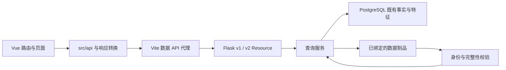

# 系统结构与数据流

本文记录主线当前实现、产品边界和调用链；领域术语及证据解释以 [CONTEXT.md](../../CONTEXT.md) 为准。C 的有限交付见[短规格](../core-overview-v1.md)，数据准入和部署结果见[台账](../data-assets-and-admission.md)与[运行手册](../runbooks/运行与维护.md)。未验证设计不属于当前运行能力。

## 源码目录与入口

2026-09-17 的整理只调整源码位置、导入和执行路径，不改变业务规则、HTTP 合同、数据格式或运行中的发布工作树。目录职责统一如下；历史评审中的命令仍记录当时的路径。

| 目录 | 职责 |
| --- | --- |
| `backend/web/` | Flask 应用、HTTP 路由与请求边界；测试移至 `backend/tests/` |
| `backend/services/` | 面向 API 的只读查询与业务编排 |
| `backend/database/` | 已绑定数据库的读取适配 |
| `backend/data_pipeline/` | 显式离线生产、计算、核验与准入，按下表划分 |
| `backend/config/`、`backend/utils/` | 应用配置定义及共用工具；实际运行配置在 Git 外 |
| `backend/tests/` | 按 `observations`、`features`、`detection`、`rib`、`resources`、`country`、`country_trend`、`core_overview`、`historical`、`migration`、`publication`、`web`、`common`、`integration` 分组；`fixtures/` 留存共用测试材料 |
| `scripts/` | 命令入口；常用启动入口保留在根目录，其余按用途分组 |
| `frontend/`、`contracts/`、`config/` | 前端源码、接口／数据合同、公共数据时间档 |
| `dev/` | 国家趋势产品开发辅助程序与固定示例材料 |
| `deploy/` | 已有服务配置模板；目录整理不执行部署 |
| `docs/` | 架构、运行和历史评审；权威位置见 README |

`backend/data_pipeline/` 按职责收敛为七个目录，主入口是 `bgp/pipeline.py`。目录用途、计算路径和文件名解释统一见[数据流水线目录说明](../../backend/data_pipeline/README.md)，不以开发阶段编号作为源码名称。既有文件级确认、算法、数据合同版本和历史准入身份规则保持原边界。

`scripts/` 根目录仅保留 `backend.sh`、`frontend.sh`、`run_backend.py`、`observations.py`。`native/` 放原生构建与独立导入入口，`pipeline/` 放冻结业务运行、迁移与重试入口，`rib/` 放 RIB 留存／比较／快照命令，`core_overview/` 放 C 输入与绑定工具，`benchmarks/` 放性能测量程序。脚本只承担参数和入口，业务逻辑继续放在 `backend/data_pipeline/`。

移动后源码身份按新路径及实际内容重新绑定；历史 producer 摘要白名单保持原值，旧冻结副本和已留存候选不自动迁移或跨版本续跑。目录与导入检查不代表真实 RIB＋8 小时 UPDATE 已通过一小时验收。

2026-09-17 随后按用户授权将主前后端切换至最新源码，并启动独立伊朗单日特征任务；配置、运行目录与验收状态见[运行手册](../runbooks/运行与维护.md#2026-09-17-最新前后端切换与伊朗单日任务)。该任务不运行普通特征或全量异常检测，不自动发布候选结果。

## 产品范围与分支边界

主线提供整体 C 首页、六类历史异常检索与详情、国家／ASN 档案、国家中断制品及确定性趋势查询。普通档案最多24小时；事件关联 ASN 查询必须绑定单 ASN 和国家事件原窗口，最多45天。页面存在不表示其所需数据完整。

独立 A 事件问答位于 `feat/event-qa-panel`／服务器 event-qa 工作树，验收状态由 [Issue #1](https://github.com/xinghuahewo/domeye_new/issues/1) 和 [#12](https://github.com/xinghuahewo/domeye_new/issues/12)维护。本轮 C 合并不引入该分支的 Agent、工具或会话实现，也不改变其独立常驻服务。主线不提供通用自然语言 Agent、模型自主调查或报告；不由 Web 发起采集、检测、重建或发布，不从控制面观测推断根因、责任和真实用户影响。

## C 首页的独立消费链

`/` → [CoreOverviewPage](../../frontend/src/pages/CoreOverviewPage.vue) → [coreOverview 客户端](../../frontend/src/api/coreOverview.ts) → `/api/v1/core-overview` 与 `/core-overview/record` → [只读服务](../../backend/services/core_overview_service.py) → 显式绑定的按日 SQLite、诊断和规模／路径摘要。列表、筛选和详情绑定同一消费版本；与旧事件库的查询不能混算为同一个不可变版本。

显式完成文件模式读取 `result_delivery` 数据库。本版本的事件语义扩展已通过隔离验证：列表只在分页之后取需要的事件语义字段，详情按引用读取。两者共用[事件语义转换](../../backend/data_pipeline/results/event_view.py)，直接暴露已有检测生命周期和结构化国家峰值，不依赖国家增强制品目录、不改写原始记录或存储摘要。含义见[事件生命周期](../usage/metrics/events.md#开始结束持续和峰值)。每个请求在只读可重复读事务内完成；跨请求仍校验最新交付版本，尚不提供历史版本读取会话。

中断时序的完成文件实现：五个 `/features/outages/*` 经同一参数边界进入 `features_service`，由 `delivery_read.read_outage_intervals` 直接读取当前事件表，不再经按月兼容视图。查询先使用同次交付已保存的起止投影排除窗口外事件，再核对原始中断字段，避免反复展开无关事件的路径正文；投影缺失或不能确定是否重叠时仍读取原字段，不据此丢弃事件。共用采样器读取同事务实际覆盖，前端按新合同保留缺口；具体数量与状态只在[指标定义](../usage/metrics/events.md#中断时序的覆盖合同)维护。国家解析入口见下文；实际运行版本以运行手册和发布回执为准。

[离线留存](../../scripts/core_overview/retain-core-overview-input.py)、[按日索引](../../scripts/core_overview/index-core-overview-inputs.py)、[规模](../../scripts/core_overview/bind-core-overview-scale.py)、[起源](../../scripts/core_overview/bind-core-overview-origin.py)和[路径绑定](../../scripts/core_overview/bind-core-overview-paths.py)由明确命令运行，输出新目录。Web 不调用这些生产入口，只读取已存在文件并校验；失败日概况／列表／趋势为null，筛选或详情不能绕过整日门禁。准入空日与失败日不同。

规模只代表实际单RIB时点；起源按已确认的private-skip规则去重，AS_SET／联盟段不拆分猜测，原始值保留。路径对照仅为两个时点的原始Peer属性组×AFI×SAFI×Prefix对象对；不是日内变化次数、稳定Peer身份或连续Session／RouteState。四个日期源修复不在本轮已接受交付内。

### 单 RIB 共享快照（#19，隔离实现）

[需求与验收权威 #18](https://github.com/xinghuahewo/domeye_new/issues/18) 的第一条实现为 [#19](https://github.com/xinghuahewo/domeye_new/issues/19)。人工 MRT fixture 和隔离 HTTP／页面已验证；#22 已完成固定真实首源的 prepare 与内置验证，真实两批生产、批次承载和全站迁移均未验收；[#20](https://github.com/xinghuahewo/domeye_new/issues/20) 已接入同版 ASN 查询与页面，仍仅限隔离实现。C 的55天可用／4天隔离边界不变。

`scripts/rib/rib-snapshot.py prepare` → [共享生产器](../../backend/data_pipeline/bgp/snapshots/snapshot.py) → [rib_origin.parse_rib](../../backend/data_pipeline/bgp/snapshots/origin.py) 同次解码 → Prefix／明确起源关联及紧凑来源定位 → 完整核验候选；`register` 再将完整版本复制到显式登记位置。Web 从不调用这两个生产操作。

查询链为 [RibSnapshotScale](../../frontend/src/components/RibSnapshotScale.vue) → [共享客户端](../../frontend/src/api/ribSnapshots.ts) → `/api/v1/rib-snapshots` 日期发现、`/rib-snapshots/{version}` 总体规模、`/rib-snapshots/{version}/observations` 有界审计分页 → [只读服务](../../backend/services/rib_snapshot_service.py)。C 的日期和地址族控制快照，列表类型、等级、搜索、小时与异常版本不改变它；同日已取得的快照版本保持固定，切日重新发现默认版本。旧异常消费版本仍独立绑定。

仅完全未设置 `DOMEYE_RIB_SNAPSHOT_REGISTRY` 时，C 规模区沿用旧行为；已设置但为空、缺失或损坏时明确不可用。新快照成功不会解除异常日隔离，快照失败也不抹去独立异常；该实现不修改旧 C HTTP 响应、共用事件／特征接口、P0 或独立 A。

单快照身份绑定压缩源 SHA256、RRC25、实际时点、已支持的 TABLE_DUMP_V2 IPv4／IPv6 单播范围、private-skip／投影规则与实现文件摘要。来源路径、输出路径、执行ID、执行时间与资源上限不进入身份；执行回执单列。重压缩后摘要变化视为另一来源。声明时点必须与实际 MRT 完全一致；数据档继续约束时间范围。

SQLite 数据合同（有界首试，不宣布全站存储定型）：

| 投影 | 保存的事实 |
| --- | --- |
| `prefixes` | 地址族／规范 Prefix、该源物理记录号、解压偏移；每个前缀一行 |
| `path_dictionary` | 原始 AS_PATH／AS4_PATH 字节、原末端、明确归属与不可归属原因；路径只保存一份 |
| `peers` | 原 Peer 表位置、BGP ID、IP、AS；这里的位置不是稳定 Peer Identity |
| `observations` | 原记录号＋条目号、Peer 表位置、Originated Time、路径关联；不同原始条目不按内容去重 |
| `origins` | 地址族／Prefix／明确起源 ASN 的去重关联；总体与 ASN 复用同一投影，不另造生产副本 |

总体 Prefix 按地址族与前缀取并集，明确起源 ASN 在双栈间也去重。至少一个明确起源的前缀＋完全无明确起源的前缀＝总体并集；不可归属观察另外计数，同前缀另一观察有明确起源不会抹去它。多起源关联均保留，单 ASN 前缀数之和不能替代总体。AS_SET（包括单元素）、联盟段等不可归属原因与原路径保持可追溯；这里只沿用已接受的 private-skip 解释，不恢复连续 Session／RouteState。

[#23](https://github.com/xinghuahewo/domeye_new/issues/23) 已实现两处逐物理 Prefix 记录复用：解析器在首次观察回调时生成规范网络文本，供该记录的其他 Peer 观察共用；未提供回调时不生成文本。共享生产器只保留当前记录已写入的明确起源集合，换记录即清空，使每个起源关联仅尝试写入一次；全部原始观察仍逐条保存。双栈、填充位、原 Peer／位置／时间、路径及未知起源规则不变，空 Prefix 记录仍拒绝。

该优化已通过人工输入的公开 prepare → register → 总体／ASN／审计查询及旧快照读取验证；#22 的固定首源完整耗时已有实测，见[台账第57节](../data-assets-and-admission.md#57-issue-22-首源生产完成与验证收口)，两批承载和覆盖尚未验收，不能从人工收益或一个来源推断整批 GO。存储合同、摘要字节算法、两遍完整摘要核验、路径缓存和资源上限不变；这两个实现文件的摘要变化自然生成新结果版本，旧结果不改写。

输入边界修正在 #21 的人工二进制 fixture 中验证：[RFC 6396 §4.3.2](https://www.rfc-editor.org/rfc/rfc6396.html#section-4.3.2) 规定 Prefix 末字节的尾随填充位无意义，解析时只屏蔽这些位以生成规范网络键；非零填充不构成损坏，源摘要、物理记录号和偏移保留。[RFC 6793 §6](https://www.rfc-editor.org/rfc/rfc6793.html#section-6) 定义的 AS4_PATH 长度不足6字节、奇数长度和段结构错误按明确损坏拒绝输入；结构有效的 AS4_PATH 保留原字节并标为 `as4_path_requires_separate_rule`，不重建起源。本离线投影执行整源准入，不实现该 RFC 的在线 UPDATE 属性丢弃流程，也不扩大 MRT 支持范围。

核验和登记实现见 [制品存储模块](../../backend/data_pipeline/bgp/snapshots/snapshot_store.py)：离线核验 gzip EOF、MRT结构、SQLite完整性、Prefix／起源集合双向对账、摘要计数及规范化表的逻辑摘要，再原子生成完成标志。登记目录中的版本不覆盖；相同身份不同逻辑正文拒绝，重复登记不改当前默认版本。清单和SQLite文件完整性摘要与逻辑身份分开。新版本的显式登记成为该日默认，旧版本继续按身份读取；批次选择见下节 #21。

HTTP 不逐请求全表计算：核对有大小上限的登记／清单、离线绑定摘要、版本／日期／时点和查询文件的设备号／inode／大小／mtime／ctime；审计分页通过只读SQLite读取并再次核对文件戳，最多100条、SQL执行上限2秒。文件变化一律不可用。文件戳是本机离线核验的连续性检查，不是不可变存储或对抗恶意改写的证明；恢复／复制到另一文件实体后须重新离线登记，不能直接沿用旧戳。资源限制与命令见[运行手册](../runbooks/运行与维护.md#单-rib-共享快照的隔离运行19)。

### 固定候选批次（#21，fixture 实现）

[任务与验收权威 #21](https://github.com/xinghuahewo/domeye_new/issues/21) 通过 `scripts/rib/rib-snapshot.py batch` 复用上述准备、核验、投影和查询。输入机器合同为 [rib-batch-input/v1](../../contracts/data/rib-batch-input.schema.json)，回执为 [rib-batch-report/v1](../../contracts/data/rib-batch-report.schema.json)。第二批更换清单与半开窗口参数，不修改页面、日期常量或机器合同。#22 已冻结36个候选摘要并完成固定首源的 prepare 与内置完整验证；额外全量重放审计按用户要求取消，未产生独立审计通过结论。原95de首源产物尚未登记；#24 已支持正式batch显式无时限及本次磁盘参数，第一批6候选已因监控扫描超时停止，正在诊断恢复路径，见[台账第58节](../data-assets-and-admission.md#58-issue-22-无时限第一批启动)。两批承载及12日覆盖仍为 Unknown，首源实测仍见[第57节](../data-assets-and-admission.md#57-issue-22-首源生产完成与验证收口)。

[批次输入与选择](../../backend/data_pipeline/bgp/snapshots/batch.py) 将同压缩源 SHA256 的路径声明归为同一来源，按实际业务日、UTC时点、SHA256固定排序；同摘要的Collector／时点冲突或声明与实际MRT不符拒绝整批。每个来源至少找到一条完整核验成功的路径才可用；路径别名成功一次即复用，不重复生成事实。为检查未选候选的声明和执行错误，每日选中首个合格源后仍核验当日其余来源；后续合格投影不登记。只跳过明确的文件缺失、摘要错误、gzip或MRT结构损坏。未支持的MRT范围、权限、设备I/O、磁盘／时长上限、SQLite、投影不一致、运行中输入／清单／代码／数据档变化和未知程序错误均中止；不根据退出码或中文错误文本换候选。

| 身份／状态 | 绑定与用途 |
| --- | --- |
| 来源内容身份 | 压缩源SHA256；重压缩后摘要变化视为不同来源；不同原始观察不按内容去重 |
| 批次选择身份 `rib_batch_v1_…` | 规范化候选集合、窗口、数据档、选择规则、输入核验规则及其实现摘要；路径、执行时刻和预算不进入身份 |
| 单快照结果 `rib_snapshot_v1_…` | 沿用单快照身份；同一快照在重叠批次复用，不因批次身份变化复制事实 |
| 执行回执 | 独立UUID、实际路径和逐路径尝试；来源级拒绝按失败类别及原因稳定汇总，不让缺失别名掩盖内容核验失败 |
| 批次逐日结果 | 每日为 `available`、`missing_input` 或 `validation_failed`；执行未到达的日为 `not_calculated`，只出现在未提交失败回执 |

先准备并核验整批，再在同一登记锁内安装版本目录、复核全部输入（包括起初缺失的路径）与运行代码，最后一次原子替换登记索引；新版本、整批逐日结果和成功日默认选择同时可见。程序、写入或索引替换前失败不改变旧索引；未登记目录不能通过HTTP发现。该保证针对普通执行错误和进程中断，不是断电、恶意改写或不可变存储保证。

普通 `register` 的重复登记不改默认。批次首次成功提交则明确选择各成功日版本，可以选回已有版本；相同选择身份再次提交核对同一报告及所引版本后幂等返回，不能回滚后来默认。同身份出现不同结果拒绝，不把变化隐藏在重试中。旧版本保留；已选版本坏时明确不可用，不回退。新批次某日缺输入或候选全失败只更新该批次结果，不删除该日已有可信默认。

日期发现响应的 `snapshots` 表示当前已发布选择，新增 `days` 描述日期状态及 `last_batch`（最近已提交批次的选择身份与该日结果）。尚无批次和默认的指定日为 `not_calculated`；已有默认仍为 `available`，同时可显示最近批次缺口。总体／ASN已完整核验的零值或空集合仍是 `available`，不会混同缺输入。损坏登记／版本返回503 `validation_failed`；未知版本404 `unknown_version`，均没有数量。未配置语义和 `latest=true` 先选后验规则不变。

C首页把已选RIB版本写入 `snapshot_version` URL；刷新、地址族切换和ASN下钻保持该版。用户改变业务日或点击“重新选择此日已发布快照”才重新发现默认；异常版本仍独立。ASN沿用下节独立日期／版本／地址族控制。Web启动和GET不创建目录、数据库、投影或登记。资源边界和执行回执判读见[运行手册](../runbooks/运行与维护.md#固定候选批次的隔离运行21)。

### 同版 ASN 快照消费（#20，隔离实现）

[ASN 页面](../../frontend/src/pages/AsnPage.vue) → 独立 [AsnRibSnapshot](../../frontend/src/components/AsnRibSnapshot.vue) → 同一个共享客户端／只读服务 → `/rib-snapshots/{version}/asns/{asn}`。按 `origins` 明确起源关联及地址族统计去重前缀，不把路径经过 ASN 当作起源，不读取旧库补数字。同 Prefix 多 Peer 计一次；多起源分别可查询，各 ASN 总数不能替代总体并集。完整核验快照内无关联返回 `available`、`prefix_count=0` 和空样本；来源失败、未知版本均无数值。

来源样本从该快照原观察中按地址族、前缀文本、条目序号固定取前20条，返回 `sample_limit=20`、`sample_truncated`。同前缀多 Peer 可出现多条样本，样本长度不是前缀总数；源SHA、原Peer属性、物理记录／条目／解压偏移和原路径均可追溯。不可归属观察仍保存在原投影和总体审计入口；不能为关联到某 ASN 而拆分 AS_SET／联盟段。

查询使用只读SQLite和查询前后文件实体戳核验，计数与样本共用2秒SQL预算；预算耗尽返回503，不输出部分计数。新候选离线建立 `origins(asn,family,prefix)` 索引，复用已有观察定位；不在GET补建索引。此改动由实现文件摘要进入新结果身份，旧版本仍可读取；旧无索引版本同样受查询预算约束，大规模是否可在预算内完成仍为 Unknown。未修改旧版本实体或批次选择规则。

ASN 使用独立 `snapshot_date`／`snapshot_version`／`snapshot_family`（`all`、`ipv4`、`ipv6`）：

| 页面选择 | 消费行为 |
| --- | --- |
| 显式版本 | 优先读取该版，显示其实际业务日和时点；日期冲突不改写版本 |
| 显式日期，无版本 | 发现并固定该日默认版本；缺日解释原因，不跳到最新 |
| 无日期和版本 | 通过 `latest=true` 只选择并核验允许范围内最新业务日的默认版本；旧日坏不阻塞该查询，最新版本坏也不回退 |
| 已发现版本 | 写入当前URL；检索、排行、返回ASN总览再选择、前进后退均保留版本与地址族；新发布不会自动跳版 |
| 用户更换快照日期／点击最新 | 清除原版本后重新发现；切地址族保持已有版本 |

`latest=true` 与 `date` 互斥；原无参全日期发现保留。C 首页仍按自己的业务日和地址族查询；“查看同一快照的 ASN”携带实际RIB版本，不携带异常索引版本。ASN快照区域位于旧特征成功门禁之外，旧特征失败不会挡住快照；请求序号与取消控制避免迟到响应覆盖新的ASN／选择。完全未配置时隐藏新区域，保留原页面行为。

旧 `start/end`、国家事件 `event_start/end` 与其请求链保持原含义；不将RIB写回旧表、等效段或五分钟序列，不补announce／withdraw，不改变独立A、P0和C的55天可用／4天隔离边界。运行及隔离验证入口见[运行手册](../runbooks/运行与维护.md#单-rib-共享快照的隔离运行19)。

## 入口与模块职责

- [前端入口](../../frontend/src/main.ts) 挂载应用和 [路由](../../frontend/src/router/index.ts)；页面使用 [API 客户端](../../frontend/src/api/client.ts)，不直接访问数据库。
- [Flask 工厂](../../backend/web/flask_app.py) 注册全局时间检查及 [v1 路由](../../backend/web/api/route.py)、[v2 路由](../../backend/web/api/v2/route.py)。HTTP 业务操作为 GET，框架另提供相应 HEAD/OPTIONS 行为。
- `backend/services` 负责查询编排、身份绑定和结果组装；`backend/database` 提供既有表查询；数据库连接通过 [惰性连接层](../../backend/config/database.py) 在首次使用时创建。
- `backend/data_pipeline` 提供离线指标与质量语义、C 留存／索引／校验与显式离线RIB处理；HTTP只使用读取部分，目录存在不表示在线运行检测或持续采集。

### 文件级路由状态流水线（隔离候选）

**当前状态（2026-09-18）：候选 `route-batch-pipeline/v3` 已接入共享内存路径字典和文件末状态保存，完整业务性能与恢复仍为 REPAIR。** 源码目录同步与服务运行状态分别见[运行手册](../runbooks/运行与维护.md#2026-09-18-源码目录同步)。当前主线是“原始 MRT → 有序批次 → 归档与共享内存计算 → 文件完整校验 → 状态、结果引用和游标共同确认”。文件末候选提交不是业务发布，不能据此称前端已能读取新结果。

各轮优化的前后差异、同口径耗时、六小时 RIB 的解释及尚未解决的问题，汇总于[数据流水线加速改动与当前困境](数据流水线加速改动与当前困境.md)。本节后面的历次试验各自绑定当时源码，不作为 v3 的重跑成绩；原“完整文件入库后 JOIN／排序再计算”的设计只适用于保留的离线入口。

显式候选入口 `scripts/observations.py route-pipeline` → [批次主循环](../../backend/data_pipeline/bgp/pipeline.py) → `NativeFile.ingest` 的有序段回调。libbgpdump 完整消息边界输出 Arrow 段；同一段由归档线程写入 Observation，并由唯一计算线程按来源清单、record、ordinal 更新状态。计算不再等待整份文件 checkpoint，也不经过全文件 message／element／path JOIN 和全局排序。文件末完成原件、归档和 EOF 校验后，才确认本文件的状态和结果。

原生领先流控阈值为 4 段，在当前段输出后等待，最坏为 5 个已生成而未确认的段（包括待字典提交的段）；Python 计算在途任务最多 1 个，前一段的归档和计算均完成后才释放共享 Arrow／IPC 缓存。原生段按配置行数或约 64 MiB Arrow 分配触发，消息边界可以超过触发值；不是任意单消息均受 64 MiB 硬限制。UPDATE 默认计算视图每次展开至多 1024 个必要字段元素，RIB 的列预取上限另见下文。慢端反压生产者，不按解析完成顺序或 timestamp 重排。零元素消息、Peer 表、EOR、STATE、解析缺口和时间倒退仍经过有序合同。

默认非详细审计的 RIB 基线使用[有界列批](../../backend/data_pipeline/bgp/state/rib_columns.py)：整段在 Arrow 中核验列类型、消息关联、连续 ordinal、事件引用、RIB action 和 ADD-PATH 存在标志；消息边界仍逐条经过原合同。每批不跨消息，预取至多 8192 个元素的必要列和路径解释，路径准备另设 64 MiB 保护。规范态直接写唯一紧凑负载，按配置启用的业务基线索引按原序更新；不构造无人消费的逐元素审计对象，也不重复按编号读取本批已有路径文本。含受限消息或历史缺口的 RIB 及详细审计保留原逐元素入口。

默认 UPDATE 使用[有界列批](../../backend/data_pipeline/bgp/state/update_columns.py)，复用同一套 Arrow 元素合同。每批最多 1024 个元素和 1024 条新消息；一条消息跨批时只发出一次消息边界，零元素控制消息仍保留。计算线程逐消息、逐元素推进唯一规范态，每条状态写入后立即调用原业务入口，然后才处理下一条。基础状态和默认业务模式都只展开必要列，完整证据留在当前 Arrow 批次；新路径解释按批准备，旧路径直接从共享内存按编号读取，不再遍历旧前缀和活动事件来预取路径。业务通过列、行下标及消息上下文直接计算，只有实际生成事件身份、结果或诊断时才冻结所需证据，活动事件不持有临时 Arrow 批次。没有历史解析缺口时直接写入紧凑状态；存在缺口时沿用原资格判断和状态更新。详细审计及混入 RIB 消息的 UPDATE 段仍使用原逐元素输入，保留原来允许的消息组合；未改 Feature／Detection 的过滤、统计和事件规则。

RIB 到计算端点的映射继续核对全部绑定 UPDATE 的唯一性。先用同版 libbgpdump 预扫 UPDATE，冻结端点集合；每份实际输出与预扫逐项核对，歧义不补成稳定 Session。RIB 使用既有完整源扫描的 Peer 表证据，并在文件末核对实际原生 Peer 表。原件 SHA、gzip 完整扫描、原生解码和归档读回仍各有成本，不能称为只物理读盘一次。历史 Resource RIB 作为独立 snapshot 归档，不进入当前 UPDATE 状态。

[共享状态](../../backend/data_pipeline/bgp/state/routes.py) 的 `prefix_dict` 是唯一规范路由状态：紧凑键区分端点、AFI／SAFI、前缀与 ADD-PATH 缺失／编号 0；值保存完整属性路径键、来源位置、存在或撤回状态以及失效上下文编号。current、last_known、positions 是按需展开的视图，不另复制整套路由负载；最后已知值可以是已撤回。缺口和断连产生 unknown，不生成伪造 withdraw。默认关闭额外 canonical 旧 VP 视图及逐条状态副本，仅详细审计时保留。

端点关联索引仅保存 `prefix_dict` 已有键的引用，状态首次插入时追加，恢复时从已校验的紧凑行重建。STATE 失效精确匹配 Peer IP／ASN、本地 IP／ASN 与 interface，只遍历相关端点的路由，保留原状态字典的相对次序；不按 ASN 合并端点，不改变原失效条件。未知或无路由端点不再触发全表逐对象展开；解析缺口的资格处理仍沿用既有逻辑。该索引增加引用数组内存，不能以无重复负载推断其容量免费。

[业务主循环](../../backend/data_pipeline/bgp/state/business.py) 可显式接入普通／IR Feature 和既有 Detection。每条元素读取其紧邻旧值、更新必要索引并执行原规则，然后才处理下一条；RIB 仅建立候选基线，不累计宣告。三种旧语义视图保留必要的 VP=ASN、过滤和起源残留差异，槽内共用窄路径文本编号；IPv4／IPv6 树只保存前缀关系与起源集合引用。路径文本按稳定编号在内存共享；属性引用的必要解释字段以每项 65 字节的定长记录保存，原始 AS_SET 和 AS4_PATH 文本不重解释。完整属性仍在 Observation，内部编号不冒充 MRT path_id。展开行缓存最多 8192 项／8 MiB；紧凑编号索引和去重文本随不同路径数增长，受整体 RSS 保护，并非固定内存缓存。完整原始属性仍只以 Observation 为证据权威。共享参考资料不按检测模块复制；当前参考映射仍整份加载，尚未实现全部参考按编号及有界缓存读取。Feature 保留 /24、/48 等价并集单位，不能与 Resource 的去重前缀数混用；RCA 不进入逐条循环。

Feature 的前缀解释在投影与计数之间复用一个纯函数缓存，最多 4096 项，只缓存长度不超过 128 字符的输入；更长的输入仍走原解释逻辑。缓存只保存不可变的规范前缀与过滤原因，不保存路径或路由状态，不改变原字符串保留、默认路由／过大前缀规则或数量单位。

Feature 与 Detection 另共用[前缀解释](../../backend/data_pipeline/common/prefix_networks.py)，最多保存 4096 个短字符串对应的规范文本、地址族和掩码长度。严格模式仅直接复用已确认的规范文本，其他写法仍执行原严格检查；不将带主机位的前缀放宽为合法严格输入。Detection 的紧邻 before／after 只复制该前缀的 Peer 槽编号和起源集合，按需解引用共享路径；后续宣告、撤回不改变已取得的快照。没有为每条观察展开全部 Peer 路径，也没有缓存动态父子关系或完整路由表。

当前候选仅在直接业务单写入者内延迟展开 Detection 输入证据：该调用者拥有适配后的输入，同步检测期间不修改它；首次生成事件身份或输出记录时，仍按原 `asdict` 规则冻结完整观察和文件证据。每条 before／after 和检测调用保持原时机。普通流式调用默认关闭该选项，详细审计也沿用立即转换。Feature 诊断由同步输出端递归冻结，去掉此前重复的一次深拷贝。此前取消任务的专用运行与产物已清理，候选源码保留；后续验证使用新的独立目录，不恢复已取消任务。该路径尚未通过完整 RIB＋8 小时 UPDATE 的一小时验收。

逐条输入适配直接读取原观察行，返回类型继续提供同版解码常量；Peer 证据摘要使用最多 4096 项、保留原值类型的缓存，摘要正文与来源身份不变。Feature 投影只构造一次紧邻观察，ASN 计数对象仅在首次出现时创建。消息解释为每个线程复用一个 JSON 解码器，仍逐条检查完整字段、版本、诊断和重复键；不缓存整份消息，也不跳过校验。

直接业务候选为重复时点与只读 AS 关系查询提供有界缓存：Detection 缓存最多 4096 个、长度不超过 128 字符的原始时点；Feature 的 4096 项缓存保留时区转换与重复小时的 `fold` 区别。AS 关系缓存只由本单写入者的只读参考创建，最多 8192 项，保留方向、原值类型和原来的六项查询优先级；每次调用仍经过原审计入口，通用 Detection 默认直接查询参考。规范化编码的短字符串字段排序键另缓存最多 4096 项，编码字节和集合／异类键规则不变。缓存不是恢复状态，进程重启后重建。

业务配置摘要沿用原 `stable` 的完整字节合同，以有界子树及分组编码送入 SHA256，避免整套参考的规范化副本和完整 JSON 字符串同时常驻。该实现仍需保存最大容器的排序键表，单个大字符串也不由节点数限制；不能宣称总内存固定。启动时的摘要和状态／业务初始化分别计入 `business_config_digest` 与 `state_business_initialization`，不再隐藏在主循环计时之前。实测该改动降低了配置摘要峰值内存，但增加摘要 CPU 时间；不将省内存等同于全链路提速。

[状态存储](../../backend/data_pipeline/bgp/state/checkpoint.py) 在计算期间只记录变化键，完整文件 EOF 与归档校验后才保存规范状态。RIB 从唯一状态字典直接分批保存一次，不另建全量脏键集合；UPDATE 同一槽多次变化只保存最后值。文件末使用有界二进制 COPY，保持原 BYTEA 与摘要合同，取消逐批状态写库以及十六进制文本转换。本轮候选升级为 `business-state/v2`：RIB 文件末保存完整业务基线，随后按“命名空间＋对象键”记录路由、计数、活动事件和质量状态的变化。窗口计数清零与持久化确认分开；同一对象在文件内多次变化只保存最终正文，删除后重建分配新的插入顺序。Detection 的嵌套可变容器向全部持久化拥有者登记变化，共享对象在恢复时重接；首次安装仍有容器转换的临时内存成本。

2026-09-18 已在本地源码移除计算侧路径 SQLite、JSON 编解码、写后读回及业务旧路径预取；共享路径从已核验 Observation 重建。解析器自己的恢复字典、原件／归档完整性校验和文件提交核验保留。内部运行绑定升级为 `route-batch-pipeline/v3`，状态正文格式不变；旧候选只读，不能跨版本续跑。本次未部署或重新启动真实业务任务。

9 月 18 日的验证仅覆盖受影响机制、私有 PostgreSQL 异常回滚及真实路径字典组件；具体数量、耗时和内存斜率见[加速验证汇总](数据流水线加速改动与当前困境.md#5-实测到底证明了什么)。没有执行新版完整 MRT 主循环的强杀恢复矩阵，也未证明完整 RIB＋UPDATE 吞吐或整组 64 GiB 容量。已知检测集合枚举恢复问题未借此次简化改变规则。

业务正文保存在 `route_file.business_rows_v2`，基线及后续变化清单由 `business_manifests_v2` 引用。清单只记录键、操作、顺序和内容摘要，并绑定前次提交；UPDATE 不再为摘要遍历和编码全体业务对象。恢复重放清单、核对最终对象集合、正文摘要及数量，按命名空间依赖和对象顺序恢复。完整 SourceEnd、归档核验及结果读回后，业务状态、规范状态、结果引用和游标仍在同一文件事务确认。旧候选只读保留，不跨版本续跑；这些机制已接入源码，真实恢复矩阵尚待本版验证，不能沿用旧版通过结论。

9 月 17 日三路优化使用真实 RIB 片段加首份完整 UPDATE 连续计算及文件末恢复，已核对业务内容、字典对象顺序、结果引用与游标一致。但该核验把集合视为无序，不能证明恢复后的后续检测相等：旧规则会从集合枚举中选择起源或证据前缀，当前容器包装与集合编码恢复会改变部分集合的枚举顺序。在同一解释器与固定散列种子下，真实 UPDATE 的 `2605:9cc0:c16::/48` 等前缀已出现编码恢复前后起源首项由 AS21664 变为 AS16509；成员仍相同。这里验证的是检测选择输入变化，尚未运行恢复后的下一文件来证明具体事件输出差异。不得将成员一致当成恢复兼容性通过；该轮判为 REPAIR，止于组件诊断，没有完成完整 RIB＋前三 UPDATE 集成或强制中断矩阵。随后用户另行要求启动的 97 文件性能试跑也超时未完成，记录见[加速验证汇总](数据流水线加速改动与当前困境.md#5-实测到底证明了什么)；不能把后一次启动当成恢复问题已经解决。

直接业务结果在 `ResultFile.append_business` 内一次完成原 `encode(plain(row))` 的正文转换，返回前已冻结成字符串；保留原集合／异类键规则和文件读回摘要合同。结果缓冲同时受 512 行与约 8 MiB 字符串内存阈值约束，超过阈值的大单行完整单独写出，回执记录最大单行与缓冲峰值；窗口行复用已冻结的前缀集合，不再先深拷贝这些集合。通用结果入口与非文件业务调用仍可使用原编码路线。这项合并只减少结果编码的重复遍历，不替代文件末业务工作态持久化，也不提前确认候选结果。

2026-09-17 的直接计算改造以“共享内存状态 → 直接计算业务字段 → 批量写结果”为目标。RIB 列批直接打包紧凑状态，在本批内复用端点头和路径摘要字节；业务路径解释使用有界缓存。非详细审计的 UPDATE 在每条规范态更新后直接调用 `apply_update_row`，普通计数不再构造中间 Observation；时间、窗口和文件上下文按实际含元素的消息准备。Detection 直接读取行字段，并与通用入口共用同一组规则；只有实际生成结果或事件身份时才按原适配器展开完整输入证据。零元素控制消息仍按来源顺序经过原边界处理，不因优化消失。窗口末 `consume_file` 由唯一写入者直接推进计数状态，只冻结窗口汇总；通用 `calculate_file` 仍保留不修改调用方状态的接口。任意异常都丢弃文件候选并从确认检查点恢复，不复用失败后的内存。

9 月 17 日普通业务对照及一小时门槛只运行普通 Feature 和 Detection，配置显式使用 `feature_modes: [ordinary]`；对照前后均如此，不能把少运行 IR 的差额记成改造收益。随后独立的伊朗单日任务启用了 IR Feature、关闭 Detection，仍建立全量规范态；该任务已取消，没有完成全天验收，不改变普通业务的验收范围。完整 RIB 的吞吐、容量与连续八小时 UPDATE 仍须单独验证，不能从 RIB 片段或已归档组件速度推断通过。

上一轮 `domeye-direct-ordinary-real-20260917T021055Z` 已用真实 RIB 前 4096 条完整消息和首份完整 UPDATE 对照：修改前后普通 Feature、Detection 输出及文件末状态一致；从原生入口归档后、UPDATE 计算事务提交前强制中断，恢复后的路由、计数、活动事件和结果与强杀前完整候选一致。该检查使用新私有数据库，没有发布结果。它验证的是这个真实样本和一个中断位置，没有覆盖所有输入边界或完整八小时；性能结论仍为 REPAIR。分阶段实测和范围记录在 Git 外的 `domeye-direct-ordinary-real-20260917T021055Z/直接计算改造验证报告.md`，不能将组件降幅当作完整链路降幅。

本轮三路优化另增加原生 RIB 编码和普通 Feature 覆盖缓存：原生对照模式中，每个最多 8192 行的预取块只编码一次端点、前缀和紧凑负载，仍按消息原序写入。真实片段逐消息字节对照一致，但状态编码未快于现有 Python 紧凑打包，因此默认继续 Python 打包，原生方案保留显式实验开关。普通 Feature 的 ASN／国家／collect 覆盖按实际关联的支持次数增减，撤回父前缀后恢复仍有支持的子前缀覆盖，不相加 ASN 覆盖量。缓存不保存路径正文，恢复时从已核验业务关联重建；原窗口频率、稀疏 ASN、完整前缀集合输出及诊断合同保留。源码接入不等于真实完整 RIB 或一小时验收通过。

旧 Detection 的集合枚举会影响 MOAS 槽位。为保留原规则，业务候选冻结 Python 版本、`PYTHONHASHSEED` 与实际散列指纹；CLI 未指定时以 0 重新启动解释器，恢复环境不符时拒绝继续，没有通过排序改写旧起源选择。

归档与计算事务相互独立。失败后丢弃当前文件工作态，核验并恢复上一个文件；归档已完成而计算未提交时，从保存且核验的原生段重放，不通过全文件 JOIN，也不因为归档存在而跳过计算。已提交计算只重建窄路径索引。gzip 部分恢复仍需顺序读到既有完整消息边界，不声称能按解压偏移随机续读。

本轮退出的是计算内存和默认结果中的整套规范路由副本。原生 IPC 段及解析阶段的磁盘索引仍按既有 M2 恢复／核验方式保留，尚未实现文件确认后的自动退役；它们与 Parquet 同时占用的磁盘必须计入预算。人工端到端测量已包含这些暂存以及业务文件尾扫描；接入旧业务后的吞吐仍需改进，不能从基础状态链路的 GO 推出完整业务性能 GO。

输出资格为 `route-batch-candidate/v1`。完整 M2 seal 与全部文件事务对齐后才记录 `route_candidate_complete`；配置业务输入时分别记录 Feature／Detection 的文件候选完成，否则明确为 `not_run`。已有人工观察／MRT、私有 PG、业务结果对照与恢复测试；后续授权的真实首 RIB 试跑已验证前 1,326,108 条元素直接计算与归档校验，以及文件确认前中断不会提交路由和业务工作态。真实前 566,118 条引用的局部对照还验证了热缓存改用保存字节摘要后，全部解释字段保持一致；这是可重建缓存的校验优化，不改变 Observation 摘要合同。整份真实 RIB＋UPDATE 的全链路吞吐、容量、恢复一致性及产品验收仍为 Unknown。未接入新增 Country／Trend 能力、RCA、跨存储业务结果交付或发布，Web API 与前端不变。默认全日迁移驱动尚未切换。

真实批次还驱动了两项内部简化：RIB 建基线不再构造无人消费的 Feature 统计观察对象；紧凑规范态将本条来源位置与路径值一次打包写入。UPDATE 仍逐条读取旧路径并执行既有统计和检测。真实 RIB 前 566,118 条的业务索引、状态字节及元数据对照一致；实际首份 UPDATE 中 657,560 次宣告和 35,077 次撤回的紧凑写入组件对照也一致。后者使用未知初始路由，不代替完整 RIB＋UPDATE 业务验收。本轮修复以对应源码绑定的真实输入回执为准，不将此前 fixture 成绩记作新版本重跑。

2026-09-16 的真实联合试跑因性能不达标，已按用户指令停止并清理本轮运行产物，原件与代码保留。最后共同完成计算／归档的 10,632,881 个元素耗时 3,220.61 秒，首 RIB 的文件检查点、状态和业务结果均未提交；停止后已核对事务回滚。直接计算线程累计 CPU 约 2,922 秒，规范状态和业务基线维护分别耗时约 806 秒、901 秒，逐条 Python 处理仍是主要瓶颈。阶段存在包含与重叠关系，不能将这些耗时相加。当前实现判为 **REPAIR**，本次实验不能作为完整链路准入证据；消除整文件 JOIN 的启动等待不等于达到高吞吐要求。历史 M2 单独完成同份 RIB 的 24 分 40 秒记录，不包含这里新增的计算层。

用户随后确认的完整真实批次性能门槛、计时起止和拒绝条件，统一见[真实主链路的一小时性能验收](../runbooks/运行与维护.md#真实主链路的一小时性能验收)。该要求已接受，当前尚未达成，不能将此前局部实现或组件对照的 GO 沿用为整条链路通过。

2026-09-16 后续有界真实对照使用首 RIB 的前 4096 条完整原始消息及完整首份 UPDATE，合计 867,744 个元素；没有生成或修改 MRT 报文，但 RIB 片段不能代替整份基线验收。新目录、空计算数据库的基础状态短基准，进程启动至退出从 459.955 秒降至 177.952 秒；其中主调用从 453.955 秒降至 171.848 秒。两次全部 Observation 列值和原始行序、355,379 个路由槽的字节摘要、元数据及文件游标一致。RIB 归档成功、状态提交前 SIGKILL 的恢复与连续结果一致；最终版本提交后重入不重复累计，生产恢复重建的端点索引与现有状态键一致。普通／IR Feature 和 Detection 的 RIB 基线索引另用真实国家参考逐项对照一致，基线组件耗时 24.35 → 7.79 秒；未运行完整业务窗口和活动事件。真实样本未覆盖 ADD-PATH、AS4_PATH、时间倒退和命中已有路由的 STATE 失效，百万以上内存斜率也未验证。上述成绩只支持保留本轮优化，当前仍为 **REPAIR，完整一小时目标不通过**。

后续 UPDATE 优化的真实回执为 Git 外 `domeye-update-real-20260916T143716Z`。同一 RIB 片段＋完整首 UPDATE、同版代码和新建私有数据库，只切换 UPDATE 输入路线，基础链路主调用从 175.914 秒降至 129.266 秒；进程启动到退出从 181.975 秒降至 134.998 秒。全部 Observation 列值与原序一致，最终仍为 355,379 个状态。完整 UPDATE 的 692,637 个元素逐条比较输入和紧邻状态通过；另以 7 元素小批验证跨消息切分。UPDATE 归档完成、结果写出而状态事务尚未提交时 SIGKILL，数据库只保留 RIB 的 175,107 个状态；复用归档恢复及提交后重入均与连续运行一致，没有重复累计。

同轮还用全部 11 类真实参考解释映射比较了普通／IR Feature 和 Detection：RIB 候选初始化、首 UPDATE 前两段 113,232 个元素的输出、运行中计数及活动事件映射一致；前缀缓存使这组业务调用的 CPU 时间从 120.309 秒降至 108.904 秒。该业务比较没有到 UPDATE EOF，不能称为完整窗口或完整业务恢复验收；参考的二月历史适用性仍为 Unknown。基础链路吞吐不能当作完整业务吞吐。百万以上状态内存斜率、完整 RIB＋8 小时 UPDATE 及未在真实样本出现的 ADD-PATH／AS4_PATH／解析缺口等情形仍未验证，结论继续为 **REPAIR，一小时目标不通过**。本轮没有重跑人工数据测试，也没有沿用其成绩冒充当前真实验收。

2026-09-17 的新独立目录 `domeye-hotloop-real-20260916T163947Z` 完成上述真实 RIB 片段＋完整首 UPDATE 的业务双路对照。273,279 条消息解释字段一致；普通／IR Feature 和 Detection 全部 672,445 行结果逐列及文件 SHA 一致，文件末 773,390 行窗口／活动事件／索引工作态一致。两文件业务调用含文件收尾和同步写出，墙钟从 673.724 秒降至 451.987 秒；双路比较总耗时不能当单路生产吞吐。完整参考配置摘要保持同一 SHA，峰值 RSS 从 18.604 GB 降至 5.157 GB，但摘要耗时从 154.041 秒增至 222.215 秒。该取舍减少内存，不构成摘要提速。

同轮在完整首 UPDATE 已归档、结果和业务工作态已写入候选事务、尚未 COMMIT 时实际 SIGKILL；数据库计算游标仍为 RIB。复用归档重放后，355,379 行规范态、773,390 行业务工作态、结果正文与强杀前完整候选一致；提交后重入的结果引用、回执、游标和计数不变。该基准是同版本事务内的完整候选，不是另一次从空库正常完成的业务全链路。首次取证脚本曾因集合 JSON 序列化失败而异常回滚，该失败已单独保留，未计作 SIGKILL 通过。成功恢复进程启动到退出 1,068.669 秒，完整重入核验 409.211 秒；两者均复用已归档输入，不能代替新处理吞吐。参考历史适用性、完整 RIB 容量、百万状态内存斜率、未在真实输入出现的 AS4_PATH／ADD-PATH／时间倒退／解析缺口，以及完整 RIB＋8 小时总耗时仍未验证。本轮仅真实数据验证，当前继续为 **REPAIR，一小时目标不通过**。

后续 `domeye-business-cost-20260916T183632Z` 继续使用同一真实归档和参考，完整业务调用墙钟从 451.987 秒降至 390.394 秒；672,445 行输出逐列及文件 SHA、各文件末业务工作态均与上一轮一致。另将真实检查点完整还原到新私有数据库，对全部 773,390 行进行解码写回对照：149.085 → 139.339 秒，正文、序号及摘要相同。该分项收益有限，仍需解决全量状态扫描。各真实业务命名空间前16行组成的451行子集，通过 COPY 合并后提交前 SIGKILL、外部回滚核验、重放和重复写入；此证据只针对持久化层，本版没有重跑整条主循环的文件游标恢复或完整 RIB＋8 小时验收。专用数据库已清理，结果与检查记录保留，结论继续为 **REPAIR**。组件耗时、暖归档读取及上一轮恢复成绩均不替代本版完整链路的3600秒门槛。

[旧文件流水线](../../backend/data_pipeline/bgp/replay/file_pipeline.py)、CheckpointReader 和完整 ObservationReader 保留为离线读取、审计及对照入口；旧文件流水线改由 `route-file-pipeline` 显式调用，仍输出 `route-file-candidate/v1`。旧 Python MRT parser 保留于离线／回归及完整源证据扫描；直接主循环的路径解码以 libbgpdump 为准。运行方式见[运行手册](../runbooks/运行与维护.md#文件级路由状态流水线的隔离运行)。

## 启动配置与时间约束

[后端启动器](../../scripts/run_backend.py) 读取项目外配置，并调用 [数据档解析器](../../dev/data_profile.py)。它清理继承环境，注入固定窗口和时区，禁用调试、初始化及启动时全量加载，并通过 `PGOPTIONS=-c default_transaction_read_only=on` 设置数据库默认只读事务。

上述配置保证依赖指定启动入口：[backend.sh](../../scripts/backend.sh) → `run_backend.py` → [run.py](../../backend/run.py) → Flask 工厂。直接运行 `backend/run.py` 仍可能加载本项目 `.env`；连接函数本身不负责补齐启动器注入的事务选项。Web数据库连接按请求隔离，成功或失败后回滚并关闭；读取错误独立返回，不伪装为成功空结果。

前端通过 [Vite 配置](../../frontend/vite.config.ts) 读取同一 [数据档](../../config/data-profile.json)，并代理数据 API。[前端启动脚本](../../scripts/frontend.sh) 清除进程中的两个窗口覆盖变量，但 Vite 的 `loadEnv` 和窗口覆盖分支仍然存在。该兼容分支与“数据档作为唯一配置来源”的约束尚未完全统一，处理方案为 **Unknown**；这不改变数据档的权威位置，也不构成使用覆盖值的授权。

[请求时间守卫](../../backend/web/data_window_guard.py) 按路由检查事件列表、特征、聚合和详情时间；部分入口有豁免或使用各自的数据身份检查，不能将它描述成对所有返回数据进行统一截断。

## 事件与档案查询

### 事件列表和证据包

[EventsPage](../../frontend/src/pages/EventsPage.vue) → [事件 API 客户端](../../frontend/src/api/events.ts) → [事件 Resource](../../backend/web/api/events/api.py) → [events_service](../../backend/services/events_service.py) → 事件总表及相应事实表。

服务根据事件类型选择详情查询，组装证据包并附加历史语义限制。前端通过响应转换形成页面模型；它没有重新运行事件检测。

### 国家与 ASN 档案

国家和 ASN 页面 → [特征 API 客户端](../../frontend/src/api/features.ts) → [特征 Resource](../../backend/web/api/features/api.py) → [country_service](../../backend/services/country_service.py) / [asn_service](../../backend/services/asn_service.py) → 相应聚合查询。

[国家中断页的 ASN 下钻 URL](../../frontend/src/components/CountryOutageGeneralPage.vue)携带事件引用与 UTC 起止时间；[ASN 页面](../../frontend/src/pages/AsnPage.vue)将其转换为无时区请求字符串，再经 [ASN 请求客户端](../../frontend/src/api/features.ts)传到 [ASN 服务](../../backend/services/asn_service.py)。服务按北京时间解析请求，重新解析事件引用并核对时间窗口，再查询指定 ASN 的数据库特征。前端通过 [业务时间转换](../../frontend/src/utils/businessTime.ts) 读取数据档时区，将事件边界转为业务时间请求，并为图表补齐绝对时间；跨浏览器时区验证见 [Issue #5](https://github.com/xinghuahewo/domeye_new/issues/5)；当前请求与响应没有沿用国家页的 `publication_id`、`cohort_id`，身份检查也未校验该 ASN 是否属于事件的固定观测集合。“同事件窗口的 ASN 特征”的产品含义见 [CONTEXT 术语](../../CONTEXT.md#事件与分析)。

[ASN 事件时段组件](../../frontend/src/components/AsnEventTimeline.vue)从事件窗口开始到结束每五分钟生成一个展示位置，按业务时间字符串匹配返回记录，没有匹配记录的位置填入 `null`。组件使用原始返回记录核对起止值、差值与极值，区分报文记录求和和资源最后有效值；图表保留空槽断线并显示已有数值点。已有记录由 [ASN 查询](../../backend/database/asn_workbench.py)读取，并经 ASN 服务的可空数值转换形成序列。补槽逻辑不提供生产端无记录原因的证明；当前调查归入 [Issue #2](https://github.com/xinghuahewo/domeye_new/issues/2)。

## 国家中断数据选择

以下描述完成文件实现，实际运行版本以运行手册和发布回执为准。[事件详情页](../../frontend/src/pages/EventDetailPage.vue) 的国家基础记录经 [国家客户端](../../frontend/src/api/countryOutageRecord.ts) 调用 `/api/v2/events/resolve`。显式完成文件模式优先选择 `result_delivery`，复用 [Core 详情服务](../../backend/services/core_overview_service.py) 与共用事件语义转换，单次返回事件、版本和实际覆盖。增强目录不存在不再阻断这一数据源；数据库读取或校验失败仍返回不可用，不切换旧来源。

页面使用共用详情中的检测时间、生命周期和结构化峰值成员。单国图表经 `/features/countries/series` 读取已有单国五分钟特征，并按文件序号关联来源时间；响应的 `data.activity` 与 `data.resources` 独立按测量时间选择：活动区间须完整落在查询内，资源末态点满足 `start < at <= end`；`source.label` 只追溯来源。资源曲线使用 `resources.at`，活动曲线使用 `activity.start`，不再读取全国家排名、前窗比较或异常聚合；处理中断图仍经共用时序接口。粗路由筛选通过 `data_loader.coarse_routing_prefixes()` 仅读取原 CSV 的前缀列，集合含义及静态资料的进程内寿命保持不变；无需完整 AS、地理与域名资料。图表须与基础事件版本一致；跨请求版本变化时显示需刷新，而非静默混用。跨请求历史版本会话尚未实现。新页面要求配套的完成文件 API，不将历史发布响应伪装为新详情。 国家两窗比较入口 `/features/countries/comparison` 复用同一请求内的 Feature、AS/前缀时序与共用统计，统一给出活动整窗合计和末样本量的比较资格；不增加数据生产或事件恢复判定。

以下为保留的历史增强数据选择，适用于未启用完成文件模式的解析，以及仍按发布读取的专用增强接口：

| 读取入口 | 来源和职责 |
|---|---|
| [通用读模型](../../backend/services/country_outage_general_read_model.py) | 由 `DOMEYE_COUNTRY_OUTAGE_GENERAL_READ_MODEL` 选择；读取 manifest、COMPLETE 及关联文件，校验摘要、事件身份和对象数量 |
| [224–310 数据层](../../backend/services/data_layer_224_310_runtime.py) | 使用生产选择配置读取既有统一数据层制品 |
| [registry](../../backend/services/country_outage_registry.py) 与 [兼容服务](../../backend/services/country_outage_service.py) | 将事件引用与已有发布映射；必要时返回旧事实摘要及明确的能力状态 |

历史 [resolve、overview、series、asns、audit 资源](../../backend/web/api/v2/country_outages.py) 优先读取通用读模型，然后尝试 224–310 数据层，再进入 registry/旧事实路径。未配置或未收录与“已选制品损坏”是不同分支，后者返回不可用。

接口并不具有完全相同的来源：

- 路径关联分页只接通用读模型，传递制品中的 `path_samples` 和每行关系语义，并返回页级 `relationship_semantics`；含义见 [CONTEXT 的解释边界](../../CONTEXT.md#证据解释边界)。[路径样本展开组件](../../frontend/src/components/CountryOutagePathEvidence.vue)区分单条样本与关系汇总时点，展示当前比较缺项；来源核查见 [Issue #10](https://github.com/xinghuahewo/domeye_new/issues/10)，有序关联措辞修正见 [Issue #4](https://github.com/xinghuahewo/domeye_new/issues/4)。
- 224–310 的 ASN 分页路径调用 `empty_asn_page`，不能据路由存在认定它提供完整 ASN 矩阵。
- 趋势接口先尝试 224–310 的 `trend`，然后调用兼容趋势生成服务；没有经过通用读模型分支。

## 趋势与 P0

### 确定性趋势

[增强观测组件](../../frontend/src/components/CountryOutageDashboard.vue) 请求趋势 API。[趋势服务](../../backend/services/country_outage_trend_product.py) 在兼容路径中读取同一发布的概览、序列和 ASN 分页，结合可选同期参照，调用趋势画像和证据编译器。前端 [趋势组件](../../frontend/src/components/CountryOutageTrendAnalysis.vue) 消费结果并提供证据导航。

`answer_trend_question_v1` 目前仅有函数定义，未接入当前公开 API 或页面。`render_contract.surfaces` 中的 report、qa、pdf 等名称属于保留的消费面元数据，不能据此推断相应产品已实现。

### P0 与旧 Dashboard 退役

2026-09-21 的源码整理移除 P0 三个与旧 dashboard 三个 GET 路由及其专用服务；现有 HTTP 共 31 个 GET 入口。此前前端旧 P0 页面已移除，主入口继续为 Core 页面。保留各业务家族独立的结果可用性与质量语义，不用一个旧候选读取器代表全系统数据。

五个旧中断曲线仍有页面消费者，旧国家观测引用保留兼容读取，共六个入口在合同标记 deprecated。范围、迁移条件及档案空值／窗口修正统一见[业务 API 设计与退役](业务只读API设计与退役.md)。历史制品和共用离线 Schema 不删除；源码改动不等于已切换运行服务。

## 合同、测试与历史材料

HTTP 结构以 [OpenAPI](../../contracts/openapi.json) 为准，类型生成方式见 [快速开始](../../README.md)。生成的原始类型与 [手写页面模型](../../frontend/src/types/api.ts)、响应转换逻辑并存；类型生成不意味着所有页面模型都自动受到相同约束。

[contracts/agent](../../contracts/agent/) 保留四份趋势数据 Schema，路径用于兼容当前合同；它不是 Agent 运行入口。[contracts/data](../../contracts/data/) 保存数据结构和样本。

| 检查类别 | 当前测试入口及能说明的范围 |
|---|---|
| 路由和启动边界 | [test_core_app.py](../../backend/tests/web/test_core_app.py)：路由白名单、退役入口、启动不访问数据或初始化 |
| HTTP 合同 | [test_openapi_contract.py](../../backend/tests/web/test_openapi_contract.py)：路径、响应合同与只读操作约束 |
| 发布身份和完整性 | [test_country_outage_general_read_model.py](../../backend/tests/web/test_country_outage_general_read_model.py)：临时制品、发布绑定、分页及损坏后拒绝读取 |
| API 数据语义与退役 | [test_api_foundation.py](../../backend/tests/web/test_api_foundation.py)：404、缺失／零、时间边界及合同 |
| 页面和转换 | [EventDetailPage.test.ts](../../frontend/src/pages/EventDetailPage.test.ts) 与 [normalize.test.ts](../../frontend/src/utils/normalize.test.ts) 检查页面及样本转换；不是现场浏览器验收 |

[趋势夹具构造器](../../dev/tests/build_country_outage_trend_product.py) 仍使用 S0、S1、S3、S4、S5 冻结输入，并被 [前端 S6 测试](../../frontend/src/components/__tests__/CountryOutageTrendAnalysisS6.test.ts) 调用。因此保留这些夹具有当前测试用途。

其中 [S0](../../dev/fixtures/country-outage-trend-analysis-s0-v1.json) 和 [S5](../../dev/fixtures/country-outage-trend-analysis-s5-v1.json) 的文档路径、提交、哈希和历史接受状态属于来源信息；引用的旧验收文档不在本仓库，不能充当本项目验收证明。旧 S0–S6 计划和 Agent 治理没有因此恢复为当前规范。

旧项目未完成的 metric-series 实验没有迁入。当前 MetricSeries Schema 仍保留离线数据合同，P0 HTTP 读取接口已退役，不能据此认定旧实验已经交付。

仓库内尚未提供 CI 配置；外部 CI、精确上游提取提交和数据供应责任仍为 **Unknown**。未解决问题按 [README 路由](../../README.md) 登记，不能补写成已接受的架构决策。

### Q3-A 人工历史冻结与类型导入（隔离实现，待独立复核）

[历史导入模块](../../backend/data_pipeline/history/database_import/__init__.py)提供人工SQLite/同事务PG冻结、每原表typed DuckLake/Parquet、固定组件行流及显式人工PG查询副本重建。只有完整封存校验、typed主体和固定回读、文件核验通过后才登记complete；无PK重复行仍有独立occurrence，隔离来源禁止business详情旁路。该入口未接HTTP、前端或业务publication/head；没有真实历史迁入。具体Interface、类型规则、0A/0B字段保留映射和验证限制统一见 [Q3-A实现说明](Q3-A历史冻结与无损类型导入.md)。
