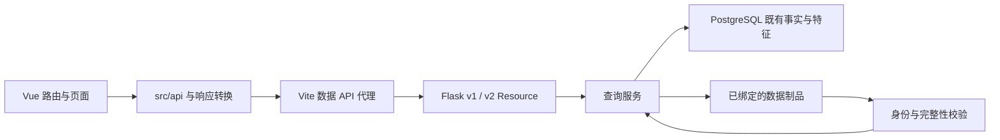

# 系统结构与数据流

本文记录当前实现的模块关系和调用链。产品能力及证据解释以 [CONTEXT.md](../../CONTEXT.md) 为准；未确认的方案不属于本文描述的当前结构。

## 入口与模块职责

- [前端入口](../../frontend/src/main.ts) 挂载应用和 [路由](../../frontend/src/router/index.ts)；页面使用 [API 客户端](../../frontend/src/api/client.ts)，不直接访问数据库。
- [Flask 工厂](../../backend/web/flask_app.py) 注册全局时间检查及 [v1 路由](../../backend/web/api/route.py)、[v2 路由](../../backend/web/api/v2/route.py)。HTTP 业务操作为 GET，框架另提供相应 HEAD/OPTIONS 行为。
- `backend/services` 负责查询编排、身份绑定和结果组装；`backend/database` 提供既有表查询；数据库连接通过 [惰性连接层](../../backend/config/database.py) 在首次使用时创建。
- `backend/data_pipeline` 在当前 Web 链路中提供 P0 指标定义和质量语义校验；目录名称不表示已接入数据生产系统。

## 启动配置与时间约束

[后端启动器](../../scripts/run_backend.py) 读取项目外配置，并调用 [数据档解析器](../../dev/data_profile.py)。它清理继承环境，注入固定窗口和时区，禁用调试、初始化及启动时全量加载，并通过 `PGOPTIONS=-c default_transaction_read_only=on` 设置数据库默认只读事务。

上述配置保证依赖指定启动入口：[backend.sh](../../scripts/backend.sh) → `run_backend.py` → [run.py](../../backend/run.py) → Flask 工厂。直接运行 `backend/run.py` 仍可能加载本项目 `.env`；连接函数本身不负责补齐启动器注入的事务选项。

前端通过 [Vite 配置](../../frontend/vite.config.ts) 读取同一 [数据档](../../config/data-profile.json)，并代理数据 API。[前端启动脚本](../../scripts/frontend.sh) 清除进程中的两个窗口覆盖变量，但 Vite 的 `loadEnv` 和窗口覆盖分支仍然存在。该兼容分支与“数据档作为唯一配置来源”的约束尚未完全统一，处理方案为 **Unknown**；这不改变数据档的权威位置，也不构成使用覆盖值的授权。

[请求时间守卫](../../backend/web/data_window_guard.py) 按路由检查事件列表、特征、聚合和详情时间；部分入口有豁免或使用各自的数据身份检查，不能将它描述成对所有返回数据进行统一截断。

## 事件与档案查询

### 事件列表和证据包

[EventsPage](../../frontend/src/pages/EventsPage.vue) → [事件 API 客户端](../../frontend/src/api/events.ts) → [事件 Resource](../../backend/web/api/events/api.py) → [events_service](../../backend/services/events_service.py) → 事件总表及相应事实表。

服务根据事件类型选择详情查询，组装证据包并附加历史语义限制。前端通过响应转换形成页面模型；它没有重新运行事件检测。

### 国家与 ASN 档案

国家和 ASN 页面 → [特征 API 客户端](../../frontend/src/api/features.ts) → [特征 Resource](../../backend/web/api/features/api.py) → [country_service](../../backend/services/country_service.py) / [asn_service](../../backend/services/asn_service.py) → 相应聚合查询。

[国家中断页的 ASN 下钻 URL](../../frontend/src/components/CountryOutageGeneralPage.vue)携带事件引用与 UTC 起止时间；[ASN 页面](../../frontend/src/pages/AsnPage.vue)将其转换为无时区请求字符串，再经 [ASN 请求客户端](../../frontend/src/api/features.ts)传到 [ASN 服务](../../backend/services/asn_service.py)。服务按北京时间解析请求，重新解析事件引用并核对时间窗口，再查询指定 ASN 的数据库特征。前端通过 [业务时间转换](../../frontend/src/utils/businessTime.ts) 读取数据档时区，将事件边界转为业务时间请求，并为图表补齐绝对时间；跨浏览器时区验证见 [Issue #5](https://github.com/xinghuahewo/domeye_new/issues/5)；当前请求与响应没有沿用国家页的 `publication_id`、`cohort_id`，身份检查也未校验该 ASN 是否属于事件的固定观测集合。“同事件窗口的 ASN 特征”的产品含义见 [CONTEXT 术语](../../CONTEXT.md#领域术语)。

[ASN 事件时段组件](../../frontend/src/components/AsnEventTimeline.vue)从事件窗口开始到结束每五分钟生成一个展示位置，按业务时间字符串匹配返回记录，没有匹配记录的位置填入 `null`。组件使用原始返回记录核对起止值、差值与极值，区分报文记录求和和资源最后有效值；图表保留空槽断线并显示已有数值点。已有记录由 [ASN 查询](../../backend/database/asn_workbench.py)读取，并经 ASN 服务的可空数值转换形成序列。补槽逻辑不提供生产端无记录原因的证明；当前调查归入 [Issue #2](https://github.com/xinghuahewo/domeye_new/issues/2)。

## 国家中断数据选择

[事件详情页](../../frontend/src/pages/EventDetailPage.vue) 依次尝试通用国家中断页、增强观测页和旧事实证据包。只有明确未配置该展示路径时才继续选择；服务不可用不会静默转换成旧页面成功。

[客户端](../../frontend/src/api/events.ts) 先 resolve 事件引用，再把取得的 `publication_id` 传入后续概览、序列、分页等请求。

| 读取入口 | 来源和职责 |
|---|---|
| [通用读模型](../../backend/services/country_outage_general_read_model.py) | 由 `DOMEYE_COUNTRY_OUTAGE_GENERAL_READ_MODEL` 选择；读取 manifest、COMPLETE 及关联文件，校验摘要、事件身份和对象数量 |
| [224–310 数据层](../../backend/services/data_layer_224_310_runtime.py) | 使用生产选择配置读取既有统一数据层制品 |
| [registry](../../backend/services/country_outage_registry.py) 与 [兼容服务](../../backend/services/country_outage_service.py) | 将事件引用与已有发布映射；必要时返回旧事实摘要及明确的能力状态 |

[resolve、overview、series、asns、audit 资源](../../backend/web/api/v2/country_outages.py) 优先读取通用读模型，然后尝试 224–310 数据层，再进入 registry/旧事实路径。未配置或未收录与“已选制品损坏”是不同分支，后者返回不可用。

接口并不具有完全相同的来源：

- 路径关联分页只接通用读模型，传递制品中的 `path_samples` 和每行关系语义，并返回页级 `relationship_semantics`；含义见 [CONTEXT 的解释边界](../../CONTEXT.md#证据解释边界)。[路径样本展开组件](../../frontend/src/components/CountryOutagePathEvidence.vue)区分单条样本与关系汇总时点，展示当前比较缺项；来源核查见 [Issue #10](https://github.com/xinghuahewo/domeye_new/issues/10)，有序关联措辞修正见 [Issue #4](https://github.com/xinghuahewo/domeye_new/issues/4)。
- 224–310 的 ASN 分页路径调用 `empty_asn_page`，不能据路由存在认定它提供完整 ASN 矩阵。
- 趋势接口先尝试 224–310 的 `trend`，然后调用兼容趋势生成服务；没有经过通用读模型分支。

## 趋势与 P0

### 确定性趋势

[增强观测组件](../../frontend/src/components/CountryOutageDashboard.vue) 请求趋势 API。[趋势服务](../../backend/services/country_outage_trend_product.py) 在兼容路径中读取同一发布的概览、序列和 ASN 分页，结合可选同期参照，调用趋势画像和证据编译器。前端 [趋势组件](../../frontend/src/components/CountryOutageTrendAnalysis.vue) 消费结果并提供证据导航。

`answer_trend_question_v1` 目前仅有函数定义，未接入当前公开 API 或页面。`render_contract.surfaces` 中的 report、qa、pdf 等名称属于保留的消费面元数据，不能据此推断相应产品已实现。

### P0 读取与准入

[首页加载器](../../frontend/src/utils/p0Home.ts) 先请求 P0 状态，核对准入、指标集合、指纹、时间窗及缺失分类，再读取其他首页数据。

[P0 服务](../../backend/services/p0_data_service.py) 仅在显式配置 `P0_DATA_RELEASE_DIR` 后读取制品，校验组件目录、哈希和跨组件引用，输出已准入指标及质量报告；它不生成、修复或激活数据制品。数据生产者、更新流程及实际部署制品的完整性不能由这段读取代码确认，仍需独立证据。

## 合同、测试与历史材料

HTTP 结构以 [OpenAPI](../../contracts/openapi.json) 为准，类型生成方式见 [快速开始](../../README.md)。生成的原始类型与 [手写页面模型](../../frontend/src/types/api.ts)、响应转换逻辑并存；类型生成不意味着所有页面模型都自动受到相同约束。

[contracts/agent](../../contracts/agent/) 保留四份趋势数据 Schema，路径用于兼容当前合同；它不是 Agent 运行入口。[contracts/data](../../contracts/data/) 保存数据结构和样本。

| 检查类别 | 当前测试入口及能说明的范围 |
|---|---|
| 路由和启动边界 | [test_core_app.py](../../backend/web/tests/test_core_app.py)：路由白名单、退役入口、启动不访问数据或初始化 |
| HTTP 合同 | [test_openapi_contract.py](../../backend/web/tests/test_openapi_contract.py)：路径、响应合同与只读操作约束 |
| 发布身份和完整性 | [test_country_outage_general_read_model.py](../../backend/web/tests/test_country_outage_general_read_model.py)：临时制品、发布绑定、分页及损坏后拒绝读取 |
| P0 准入 | [test_p0_data_api.py](../../backend/web/tests/test_p0_data_api.py)：测试制品的缺失分类、哈希及跨组件一致性 |
| 页面和转换 | [EventDetailPage.test.ts](../../frontend/src/pages/EventDetailPage.test.ts) 包含源码字符串断言；[P0 加载测试](../../frontend/src/utils/p0Home.test.ts) 验证注入样本下的行为，两者都不是现场浏览器验收 |

[趋势夹具构造器](../../dev/tests/build_country_outage_trend_product.py) 仍使用 S0、S1、S3、S4、S5 冻结输入，并被 [前端 S6 测试](../../frontend/src/components/__tests__/CountryOutageTrendAnalysisS6.test.ts) 调用。因此保留这些夹具有当前测试用途。

其中 [S0](../../dev/fixtures/country-outage-trend-analysis-s0-v1.json) 和 [S5](../../dev/fixtures/country-outage-trend-analysis-s5-v1.json) 的文档路径、提交、哈希和历史接受状态属于来源信息；引用的旧验收文档不在本仓库，不能充当本项目验收证明。旧 S0–S6 计划和 Agent 治理没有因此恢复为当前规范。

旧项目未完成的 metric-series 实验没有迁入。当前 MetricSeries Schema 和 P0 读取接口保留的是既有制品的读取合同，不能据此认定旧实验已经交付。

仓库内尚未提供 CI 配置；外部 CI、精确上游提取提交和数据供应责任仍为 **Unknown**。未解决问题按 [README 路由](../../README.md) 登记，不能补写成已接受的架构决策。
